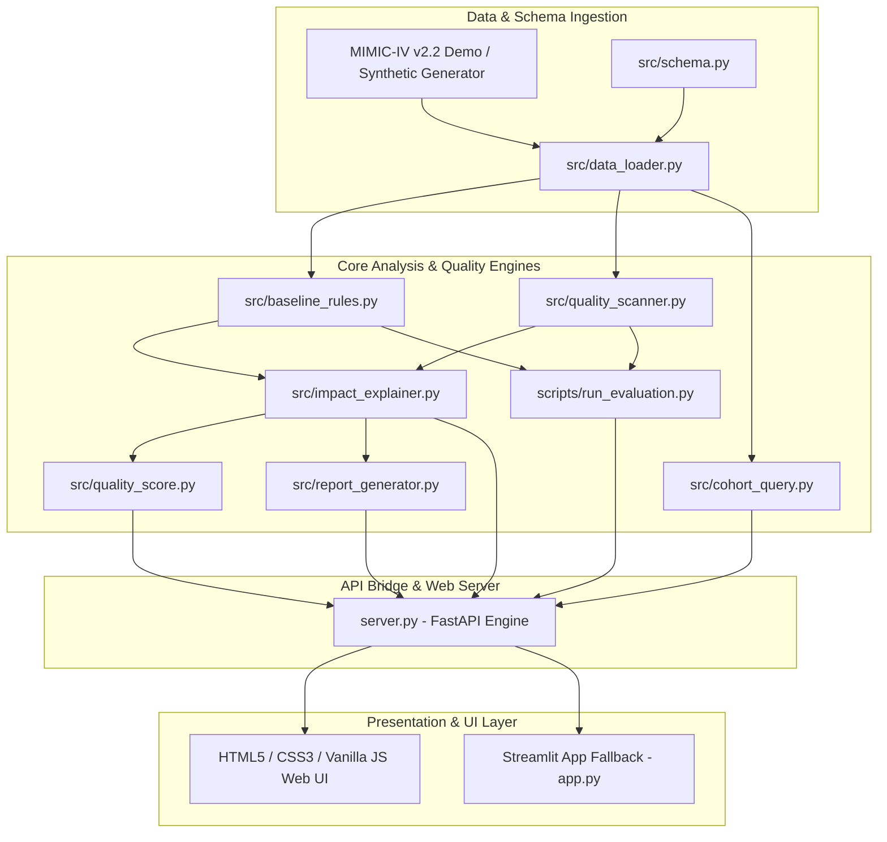

# MIMIC-IV Cohort & Data Quality Explorer

**Sofstica Hackathon 2026 — Theme: AI for Smarter Patient Care — Track 2: Cohort & Data Quality Explorer**

> ⚠️ **Research and educational prototype only. Not for clinical use.**
> Do not use for diagnosis, treatment, triage, or emergency decisions.

---

## 1. Executive Summary & Pitch

Hospital electronic health records (EHR) live across deeply fragmented relational tables. Before clinical research models or trial cohorts can be built, datasets suffer from hidden corruptions: near-duplicate encounter records, out-of-order ward transfer timestamps, extreme physiological measurement outliers, and string format fragmentation.

The **MIMIC-IV Cohort & Data Quality Explorer** is an explainable AI and data quality audit engine that:
1. **Parses Natural Language Cohort Queries** into transparent, pattern-matched relational inclusion filters with explicit clause attrition tracking.
2. **Scans Datasets using AI/ML Statistics** (per-lab-item median + MAD Z-scores, time-window overlap analysis, and cross-table containment checks) alongside hardcoded deterministic baseline rules.
3. **Translates Anomalies into Clinical Risk** via an automated **Clinical Impact Explainer** detailing patient safety risks, research bias risks, and recommended actions.
4. **Calculates a Composite Dataset Quality Score (0–100)** to provide institutional review boards and PIs with an instant data trust rating.
5. **Enforces Absolute Source Data Immutability** by routing all flagged issues to a human-in-the-loop audit queue and exporting publication-ready **PDF Quality Reports**.

---

## 2. Architecture Diagram



---

## 3. Key Innovations vs. Baseline Rules

| Dimension | Baseline Deterministic Rules | MIMIC-IV AI Quality Scanner |
| :--- | :--- | :--- |
| **Outlier Detection** | Fixed hardcoded global thresholds (e.g. `val < 0` or `val > 1000`) | **Learned per-item distribution**: Robust Z-scores via Median & MAD fit per `itemid`. Abstains on thin data ($n < 8$). |
| **Encounter Duplicates** | Byte-identical exact row duplicate match only | **Near-duplicate time window overlap**: Calculates overlap fraction across admission timestamps for same patient. |
| **Temporal Integrity** | Simple within-table time order (`dischtime < admittime`) | **Cross-table relational containment**: Joins `transfers` vs `admissions` to detect drift outside parent stay windows. |
| **Categorical String Matching** | Exact string case matching | **Fuzzy string normalization**: Uses sequence similarity algorithms (`difflib`) to catch fragmented categories. |
| **Clinical Risk Context** | Technical column error message | **Clinical Impact Explainer**: Maps flags to Clinical Risk, Research Bias Risk, Risk Level, and Action. |
| **Governance** | Manual spreadsheet checks | **Dataset Quality Index (0-100)** & 1-Click PDF Audit Report Export. |

## 🌐 Live Web Application & Deployment

- **Live HTML5/CSS3/JS Web Portal**: [https://web-production-d031ce.up.railway.app](https://web-production-d031ce.up.railway.app)
- **GitHub Repository**: [https://github.com/syedmabdullahh/mimic-cohort-data-quality-explorer](https://github.com/syedmabdullahh/mimic-cohort-data-quality-explorer)

---

## 4. Quick Start & Installation

### Step 1: Clone the Repository
```bash
git clone https://github.com/syedmabdullahh/mimic-cohort-data-quality-explorer.git
cd mimic-cohort-data-quality-explorer
```

### Step 2: Install Dependencies
```bash
pip install -r requirements.txt
```

### Step 3: Run the Web Dashboard (FastAPI + HTML/CSS/JS)
```bash
python server.py
```
Open **[http://127.0.0.1:8000](http://127.0.0.1:8000)** in your browser and click **⚡ 1-Click Judge Demo**.

### Step 4 (Alternative): Run Streamlit Executive Suite
```bash
python -m streamlit run app.py
```

### Step 5: Run Automated Tests
```bash
python -m unittest discover tests
```

---

## 5. 2-Minute Judge Demo Script & Flow

1. **0:00 - 0:30 (Overview Landing Page)**: Open `http://127.0.0.1:8000`. Highlight the **Clinical Safety Guarantee** (data immutability) and click **⚡ 1-Click Judge Demo** in the sidebar.
2. **0:30 - 1:00 (Data Quality & Scores)**: Navigate to **AI Quality Scanner**. Show the **Dataset Quality Score Cards** (`Overall Quality Index`, `Outlier Score`, `Temporal Score`), the **Visual Lab MAD Distribution Chart**, and the **Clinical Risk Explainer cards**.
3. **1:00 - 1:30 (Cohort Builder)**: Open **Cohort Builder**. Enter `age over 65 and diagnosis of sepsis`. Demonstrate the transparent **Filter Clause Match Attrition Bar Chart** and explicit unparsed token warnings.
4. **1:30 - 2:00 (Human Queue & PDF Export)**: Navigate to **Human Review Queue**. Show how flags are accepted/rejected in a reversible audit log. Click **Download PDF Audit Report** in the sidebar to view the publication-ready PDF deliverable.

---

## 6. Project Structure

```text
mimic-cohort-explorer/
├── app.py                      # 6-Page Executive Streamlit SaaS Web Application
├── server.py                   # FastAPI REST API Backend Server (Port 8000)
├── requirements.txt            # Python dependencies (pandas, numpy, scikit-learn, streamlit, fastapi, uvicorn, reportlab)
├── README.md                   # Complete documentation and quickstart guide
├── src/
│   ├── schema.py               # MIMIC-IV official schemas & column types
│   ├── data_loader.py          # CSV loader, schema coercion, and error reporter
│   ├── baseline_rules.py       # Non-learned deterministic rule engine
│   ├── quality_scanner.py      # Statistical AI scanner (Median/MAD Z-scores, temporal drift)
│   ├── cohort_query.py         # Natural-language query parser & bundle filter
│   ├── impact_explainer.py     # Clinical & Research Risk Explainer module
│   ├── quality_score.py        # Composite Dataset Quality Score Engine (0-100)
│   ├── executive_insights.py   # Risk Prioritization Engine & Executive Summarizer
│   └── report_generator.py     # PDF Audit Report Generator using ReportLab
├── static/                     # HTML5 / CSS3 / Vanilla JS Web Interface
│   ├── index.html              # Modern glassmorphic web portal
│   ├── style.css               # Clinical Dark Slate theme styling
│   └── app.js                  # Frontend Chart.js renderer & REST client
├── tests/                      # Automated unit test suite (15 tests passing)
├── data/synthetic/             # Seeded synthetic benchmark dataset
└── docs/                       # Serialized evaluation metrics output
```

---

## 7. Submission Summary (< 1000 Characters)

The MIMIC-IV Cohort & Data Quality Explorer is an explainable AI and data quality audit engine built for clinical researchers. Hospital electronic health records suffer from hidden corruptions: near-duplicate encounters, out-of-order transfer timestamps, and physiological outliers that severely bias research models. Our platform addresses this with 4 core innovations: (1) A transparent Natural Language Cohort Engine that parses queries into explicit filter clauses with zero LLM hallucinations; (2) An AI Quality Scanner utilizing per-lab-item median/MAD Z-scores, near-duplicate admission window overlaps, and cross-table temporal drift checks; (3) A Dataset Quality Score Engine (0-100) and Clinical Impact Explainer mapping flags to clinical risk, research bias risk, and recommended actions; and (4) A human-in-the-loop reversible audit queue with 1-click publication-ready PDF Audit Report generation. Absolute source data immutability is preserved.
